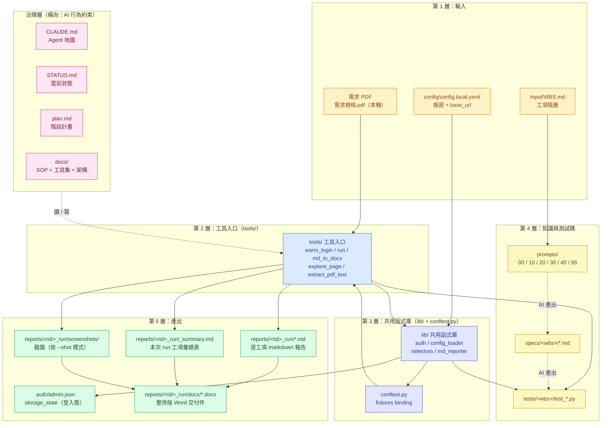
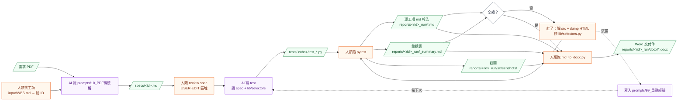

# 技術架構

> **對誰寫**：下一位接手 / 把這套搬到別的活動站的工程師。
> **解決什麼**：「我打開這個 repo，但不知道哪個目錄做什麼、檔案怎麼互相叫用、從哪一步開始動」。
> **怎麼用**：先看 §3 的整體圖把腦袋裝起來 → 再看 §4 對照一週工作怎麼跑一遍 → §6 是真正動手做事的步驟。
>
> 最後更新：2026-05-08

---

## 1. 一句話定位

**WBS 工項驅動的黑箱自動化測試 POC**，輸入是 PDF 規格 + 受測網站 URL，輸出是「按工項分目錄的 docx 測試報告」。AI（Claude Code）負責 spec 展開與 test 撰寫，人類負責決策、跑 pytest、review。

技術棧：Python 3 + Playwright + pytest，受測前端是 Vue 3 + PrimeVue（read-only 參考用）。

---

## 2. 目錄樹

```
POC_for_autotest/
├── (上述 input/ 含原始規格 PDF 與 WBS)
├── README.md                 入口 + Quickstart
├── CLAUDE.md                 Agent 行為約束 + 子文件地圖
├── STATUS.md                 當前進度錨點（高頻變動，不進 git）
├── plan.md                   階段化任務計畫（P0–P7）
├── input/                    人類輸入素材（跨專案最該替換）
│   ├── WBS.md                工項階層清單（驅動測試的索引）
│   ├── 需求規格.pdf           原始 PDF（本機保留，gitignored）
│   └── README.md             input 目錄角色說明
├── pytest.ini                pytest 設定（pythonpath、markers）
├── conftest.py               fixture 注入：config / storage_state / sessionStorage
├── requirements.txt
│
├── config/                   設定範例與本機設定（含帳密；example 進 git，local 不進）
│   ├── config.example.yaml
│   └── config.local.yaml     （gitignored）
│
├── lib/                      共用模組（被 tests/ + tools/ 引用）
│   ├── auth.py               session 載入、過期檢查、storage_state 路徑
│   ├── config_loader.py      讀 config.local.yaml
│   ├── md_reporter.py        pytest plugin：產 reports/<rid>_run/*.md
│   └── selectors.py          DOM selector helpers（EventListPage 等 Page Object）
│
├── tools/                    CLI 入口（一次性工具）
│   ├── warm_login.py         手動跑登入流程，把 storage_state 存到 .auth/
│   ├── extract_pdf_text.py   從需求 PDF 抽文字餵 AI
│   ├── explore_page.py       探查任意頁的 button / heading / placeholder（解 selector 用）
│   ├── run.py                整合 runner（--smoke / --warm-login / --wbs <id>）
│   ├── md_to_docx.py         把 reports/<rid>_run/*.md 整併成 docx
│   └── dump_*.py             臨時 storage / runtime dump 工具
│
├── prompts/                  工程化提示詞庫（可跨專案重用）
│   ├── 00_專案發起_提示詞.md
│   ├── 10_PDF轉規格_提示詞.md
│   ├── 99_重點經驗.md         踩坑紀錄（learnings；累加）
│   └── README.md             流程導覽（00→10→20→30→40→99）
│
├── specs/                    需求規格 md（從 PDF 展開，依工項分目錄）
│   └── <wbs-id> <名稱>/<id>.md
│
├── tests/                    pytest 測試案例（依工項分目錄）
│   └── <wbs-id> <名稱>/test_*.py
│
├── reports/                  測試報告（每次執行一個 run 目錄）
│   └── <YYYYMMDD_HHMM>_run/
│       ├── *.md              逐 case markdown
│       ├── shots/            截圖（依 --shot 模式）
│       └── docx/             整併版 docx 交付
│
├── docs/                     人類向延伸文件
│   ├── README.md             本目錄索引
│   ├── 使用手冊.md            Part A 協作 SOP + Part B CLI 速查（合併版）
│   └── 技術架構.md            ← 本檔
│
├── notes/                    簡報素材庫（餵 make-pptx skill）
├── src/                      受測前端 read-only 鏡像（解碼 selector 用）
├── .auth/                    storage_state 登入態（gitignored）
└── .claude/                  Claude Code hook 範本（未啟用）
```

---

## 3. 模組分層架構

把上述目錄按「**誰被誰呼叫**」分成五層。下層被上層呼叫；同層橫向依賴明示。



**怎麼讀這張圖**：

- **實線**：執行時的呼叫 / 檔案讀寫
- **虛線（-.->）**：AI 介入動作（非程式碼依賴）
- **層級越下**：越靠近資料、越被動；**層級越上**：越靠近使用者、越主動觸發
- **產出層三類報告**：`*.md`（逐工項）/ `_summary.md`（本次彙總）/ `screenshots/`（截圖）→ 三者一起餵給 `tools/md_to_docx.py` → 整併為 Word `.docx` 交付件

---

## 4. 一週工作的資料流

實際操作時不會把所有層都動到。下圖是「**一個工項從 0 到 docx 交付**」的單次循環，對應 `docs/使用手冊.md` Part A Q3 的 5 步流程。



**關鍵橋接**：

| 步驟 | 觸發者 | 讀什麼 | 寫什麼 |
|---|---|---|---|
| spec 展開 | AI | `input/需求規格.pdf` + `input/WBS.md` + `prompts/10_*` | `specs/<id>.md` |
| spec review | 人類 | `specs/<id>.md` | 在 `<!-- USER-EDIT -->` 區塊改 |
| 寫 test | AI | spec + `lib/selectors.py` + `prompts/99_*` | `tests/<wbs>/test_*.py` |
| 跑 pytest | 人類 | `tests/` + `conftest.py` + `lib/auth.py`（讀 `.auth/`）| `reports/<rid>_run/*.md` |
| selector 除錯 | 人類 + AI | dump HTML / `tools/explore_page.py` | 改 `lib/selectors.py` |
| 產 docx | 人類 | `reports/<rid>_run/*.md` + shots | `reports/<rid>_run/docx/` |
| 沉澱 learnings | AI | session 教訓 | `prompts/99_重點經驗.md` |

---

## 5. 各目錄職責表

| 目錄 / 檔案 | 角色 | 誰呼叫它 | 它呼叫誰 |
|---|---|---|---|
| `config/` | 帳密 + base_url + browser 設定 | `lib/config_loader.py` | — |
| `lib/auth.py` | session 過期檢查、storage_state 路徑 | `conftest.py`、`tools/run.py`、`tools/warm_login.py` | `lib/config_loader.py` |
| `lib/selectors.py` | Page Object（DOM selector helpers） | `tests/`、`tools/explore_page.py` | — |
| `lib/md_reporter.py` | pytest plugin，逐 case 寫 md 報告 | 透過 `pytest_plugins` 載入 | — |
| `lib/config_loader.py` | 讀 `config.local.yaml`、合併 example | `lib/auth.py`、`conftest.py` | — |
| `conftest.py` | 注入 `config` / `browser_context_args` / sessionStorage | pytest 自動拾取 | `lib/auth.py`、`lib/config_loader.py` |
| `tools/warm_login.py` | 開瀏覽器人工登入，產 `.auth/admin.json` | 人類 CLI | `lib/auth.py` |
| `tools/extract_pdf_text.py` | PDF → text 餵 AI | 人類 / AI CLI | — |
| `tools/explore_page.py` | 探查任意 URL 的 button / heading | 人類 CLI（解 selector 用） | `lib/auth.py`（要 session） |
| `tools/run.py` | 整合 runner（包 pytest） | 人類 CLI | `lib/auth.py`、pytest |
| `tools/md_to_docx.py` | md → docx 整併 | 人類 CLI | `python-docx` |
| `prompts/` | AI 行動腳本（每週重放） | AI 自身 | — |
| `specs/` | 規格的中間表示 | AI 寫 test 時讀 | — |
| `tests/` | pytest 測試碼 | `pytest` / `tools/run.py` | `lib/selectors.py`、`lib/md_reporter.py`（透過 fixture） |
| `reports/` | 測試結果（md + 截圖 + docx） | `tools/md_to_docx.py` 讀；人類交付 | — |
| `docs/` | 人類向永久性文件 | 人類 / AI 查閱 | — |
| `notes/` | 簡報素材庫（餵 make-pptx） | `make-pptx` skill | — |
| `STATUS.md` | 當前進度錨點（session 開場讀） | AI / 人類 | — |
| `input/WBS.md` | 工項索引 | AI / 人類 | — |
| `input/需求規格.pdf` | 規格來源 PDF（本機保留） | AI（`tools/extract_pdf_text.py`） | — |
| `CLAUDE.md` | Agent 行為約束 | Claude Code 自動載入 | — |
| `plan.md` | 階段化大方向（P0–P7） | AI / 人類 | — |

---

## 6. 給「下一個專案使用人」的進入路徑

假設你拿到的是另一個受測網站，只要走以下七步：

1. **讀 `README.md` 跟 `CLAUDE.md`**：5 分鐘掌握技術棧 + 行為約束。
2. **裝環境**：`python -m venv .venv` → `pip install -r requirements.txt` → `playwright install chromium`。
3. **填本機設定**：`copy config\config.example.yaml config\config.local.yaml`，填入新站的 `base_url` / `username` / `password`。
4. **跑 warm-login**：`python tools\warm_login.py`，手動登入一次，產 `.auth/admin.json`。
5. **冒煙**：`python tools\run.py --smoke` 確認登入態通了、報告器會產目錄。
6. **挑一個工項試水溫**：丟給 AI 一句「跑 `prompts/10_PDF轉規格_提示詞.md` 對 X-Y-Z 工項」，產 spec md。
7. **進入 `docs/使用手冊.md` Part A Q3 的 5 步流程**：spec review → 寫 test → 跑 pytest → 紅了除錯 → docx 交付。

整個過程**不需要改 `lib/`、`tools/`、`prompts/`** — 它們是跨專案可重用的骨架。

---

## 7. 跨專案重用要替換的東西

從這個 repo 複製到下一個專案時，**保留**框架、**替換**內容：

| 動作 | 路徑 | 說明 |
|---|---|---|
| ✅ 保留 | `lib/`、`tools/`、`prompts/`、`conftest.py`、`pytest.ini`、`requirements.txt` | 跨專案骨架，不動 |
| ✅ 保留 | `docs/`（本檔 + 使用手冊 + README） | 流程文件，可微調但概念通用 |
| 🔄 替換 | `input/WBS.md` | 新站的工項階層 |
| 🔄 替換 | `input/需求規格.pdf` | 新站的規格 PDF（user 本機放置） |
| 🔄 替換 | 需求 PDF | 新站的規格 |
| 🔄 替換 | `config/config.local.yaml` | 新站的帳密 / URL |
| 🔄 替換 | `lib/selectors.py` 的 Page Object | 新站的 DOM 結構 |
| 🧹 清空 | `specs/`、`tests/`、`reports/`、`.auth/`、`notes/` | 重新生成 |
| 🧹 重置 | `STATUS.md`、`plan.md` | 新專案重新規劃 |
| 📌 沿用 | `prompts/99_重點經驗.md` | learnings 是跨專案資產，**保留並增補** |

---

## 變更紀錄

- 2026-05-08 初版建立（P7 工程化沉澱階段；補 docs/README.md 中「architecture.md 未建立」的洞）
- 2026-05-08 mermaid 圖簡化：tools/ 與 lib/ 收合不展開內部 .py；產出層拆出 md / summary / screenshots / docx 四個明確 artifact
- 2026-05-08 反映目錄重整：input/ 取代根目錄 WBS.md + PDF；docs/ 內 工具指令集 + 合作SOP_QA 合併為 使用手冊；流程圖生成規則 移到 notes/
