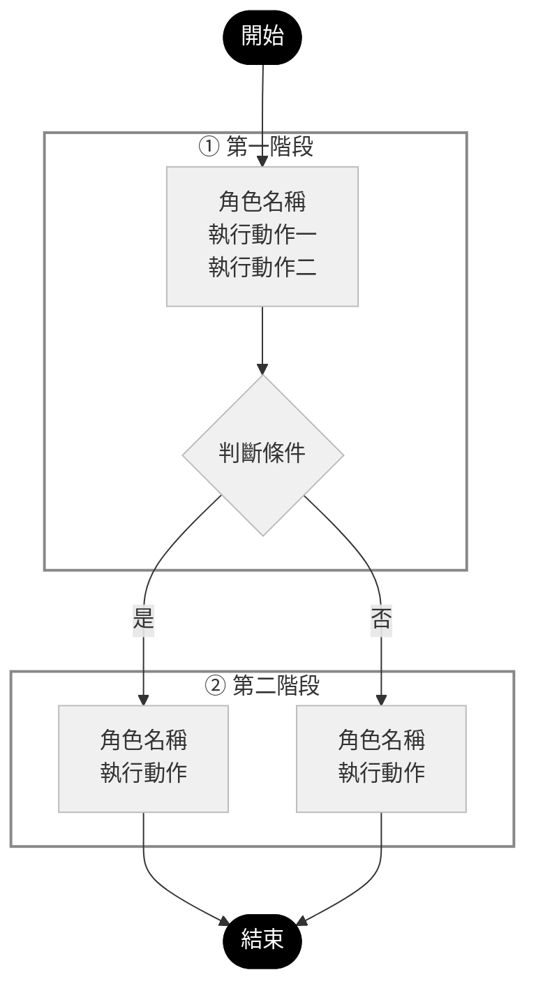

# SOP 流程圖生成規則

> 依 2026-04-28 實作過程確認之規範，適用於 `flows/sop-flow-§XX-*.md` 所有章節。

---

## 1. 檔案格式

- 每個 SOP 章節一個獨立 `.md` 檔，命名規則：`sop-flow-§XX-<章節標題>.md`
- 檔案放在 `poc_project_hub/system/sop/flows/` 目錄下
- 每份檔案結構：
  1. `# §XX 章節標題`（H1）
  2. 來源與最後更新資訊（blockquote）
  3. mermaid 程式碼區塊（流程圖）
  4. `## 角色說明`（表格）
  5. `## 涉及表單`（表格）

---

## 2. Mermaid 基本宣告

```
flowchart TD
    classDef startNode fill:#000,color:#fff,stroke:#000
    classDef endNode fill:#000,color:#fff,stroke:#000
    classDef default fill:#f0f0f0,stroke:#bbb,color:#333

    START([開始]):::startNode
    END([結束]):::endNode
```

- 使用 `flowchart TD`（縱向，適合貼入 Word）
- **禁止** 使用 `graph TD` 或 `flowchart LR`
- START / END 節點固定使用 `([開始])` / `([結束])` 加上 `:::startNode` / `:::endNode`

---

## 3. 節點寫法

### 3-1 一般執行節點（矩形）

```
A[角色名稱<br/>動作第一行<br/>動作第二行]
```

- **第一行固定為中文角色名稱**（直接寫 SOP 原文名稱，不用代號）
- 後續行為具體動作說明
- 換行一律使用 `<br/>`，**禁止** 使用 `\n`

### 3-2 判斷節點（菱形）

```
D{判斷條件文字}
```

- 條件文字盡量一行；必要時可用 `<br/>` 換行

### 3-3 括號使用規則（重要）

- 節點文字內的括號**一律使用全形 `（）`**
- 半形 `()` 會與 stadium 節點語法 `([...])` 衝突，導致 Parse error
- 錯誤示範：`犬(貓)切結書` → 正確：`犬（貓）切結書`

---

## 4. subgraph（階段）寫法

```
subgraph S1["① 階段名稱"]
    A[...]
    B[...]
end
style S1 fill:transparent,stroke:#888,stroke-width:2px,color:#333
```

- 標題格式：`"① 階段名稱"`（圓圈數字 + 空格 + 階段名稱）
- 標題**只放階段名稱**，**不放角色名稱**（角色已在節點第一行呈現）
- 標題**禁止使用 `<br/>`**（會導致標題文字與節點圖塊重疊）
- 每個 subgraph 對應的 `style` 宣告必須緊接在 `end` 之後，且寫在 mermaid 區塊**內部**（不是外部 markdown）
- subgraph id 依序命名：`S1`, `S2`, `S3`…

---

## 5. 連線與標籤

```
A --> B
D -->|是| E
D -->|否| F
```

- 一般流向用 `-->`
- 條件分支在箭頭上加標籤 `-->|標籤文字|`

---

## 6. 完整範例模板

````markdown
# §XX 單位-章節標題

> 來源：`機關提供資料\案件辦理準則SOPV2025年更正.docx` §XX（sop_text.txt 第 XXX–XXX 行）
> 最後更新：YYYY-MM-DD



## 角色說明

| 角色代號 | SOP 原文名稱 | 主要職責 |
|---|---|---|
| `role-code` | SOP 原文角色名稱 | 職責描述 |

## 涉及表單

| 表單編號 | 名稱 | 使用時機 |
|---|---|---|
| P-XX 表單名稱 | 表單名稱 | 使用時機說明 |
````

---

## 7. 涉及表單區塊維護規則

- 出處校正或表單新增／移除：**只更新 `flows/sop-flow-§XX-*.md` 涉及表單區塊**
- **不動** `sop-forms-list.csv`
- 跨章節同一張表單出處有誤時，須同步更新**所有相關流程圖檔**的涉及表單區塊

---

## 8. 常見錯誤對照

| 錯誤寫法 | 正確寫法 | 原因 |
|---|---|---|
| `flowchart LR` | `flowchart TD` | 橫向不適合貼入 Word |
| `graph TD` | `flowchart TD` | 舊語法，subgraph style 支援較差 |
| `節點文字\n換行` | `節點文字<br/>換行` | `\n` 在 mermaid 節點內會被當成字面字元 |
| 標題 `"① 階段<br/>角色"` | 標題 `"① 階段"` | `<br/>` 在 subgraph 標題會造成文字與節點重疊 |
| `犬(貓)切結書` | `犬（貓）切結書` | 半形括號觸發 stadium 節點語法衝突 |
| subgraph style 寫在 mermaid 外 | style 宣告寫在 mermaid 區塊內 | 外部 style 無效 |
